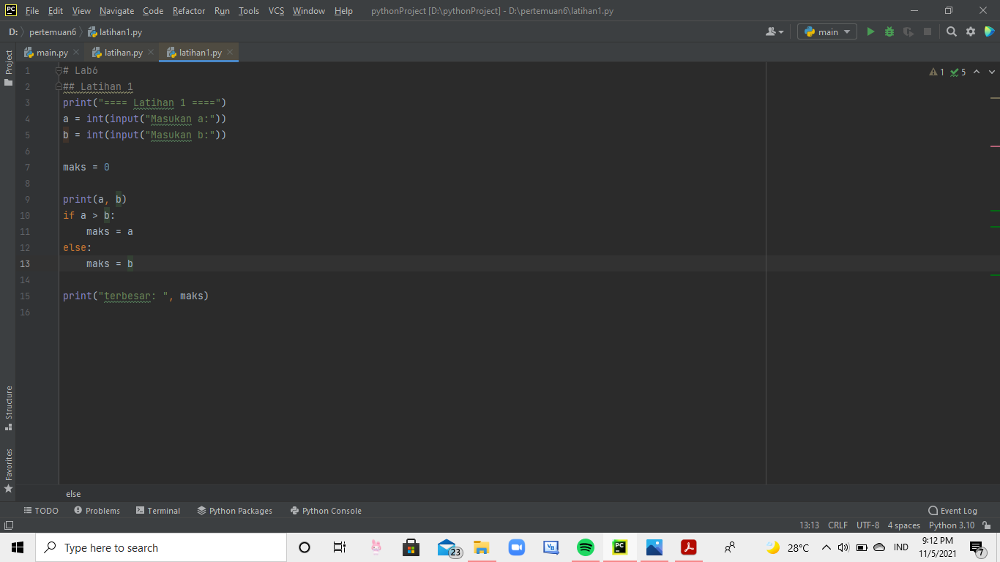
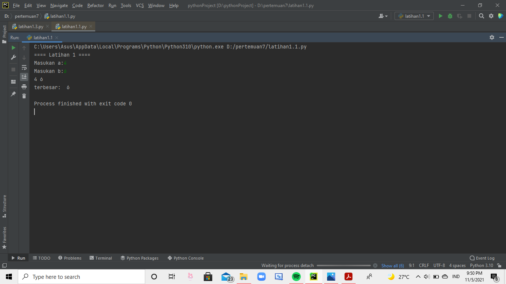
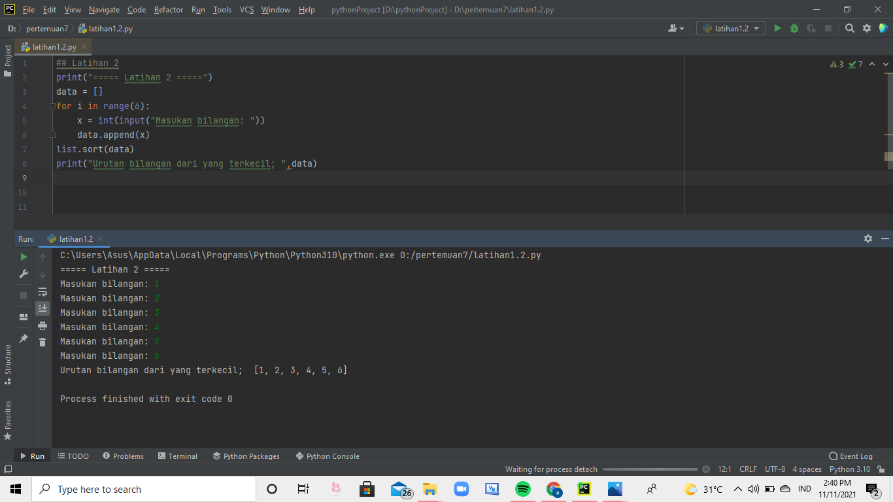
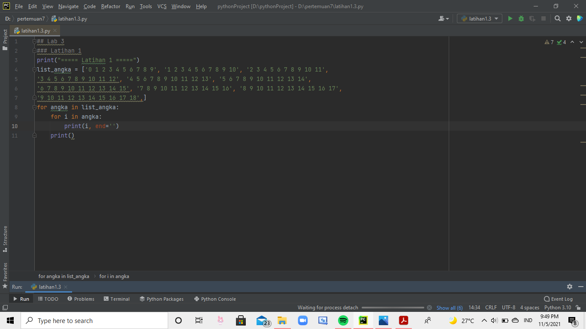
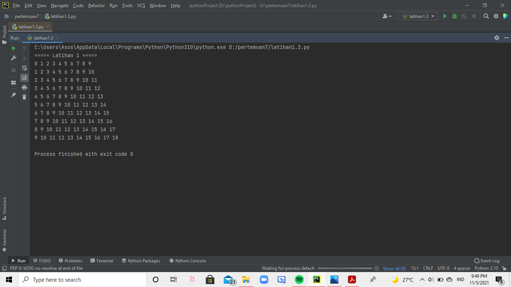
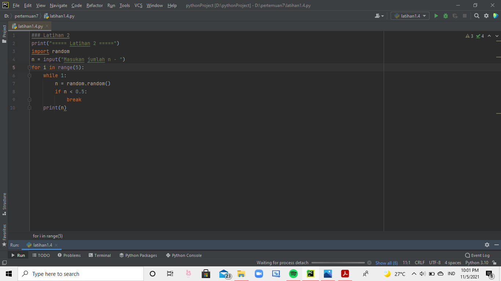
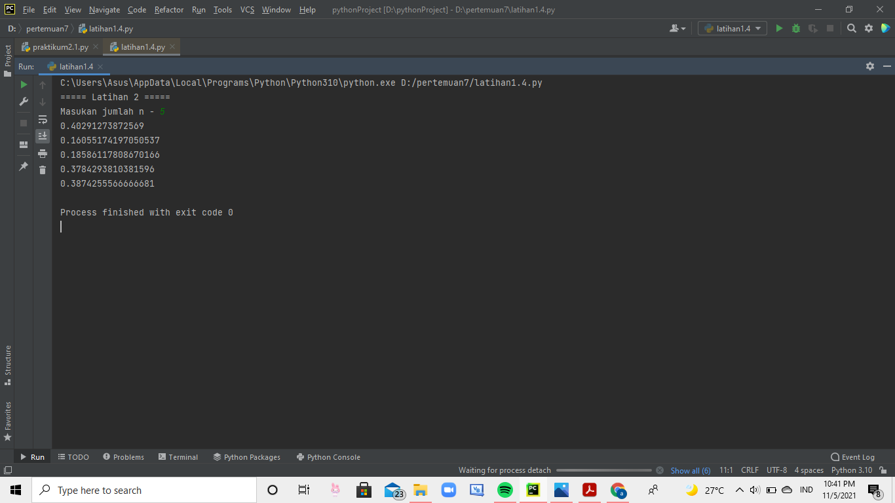

# tugaass7

## latihan pertama
memasukan kode input a dan b lalu masukan juga kode maks nya 

print a dan b lalu masukan kode if dan else seperti digambar ini 

lalu ketik print terbesarnya 

kemudian di run. dan hasilnya akan jadi seperti ini 

## latihan kedua
masukan kode seperti ini lalu di print dan kemudian di run 

hasilnya akan seperti jadi ini 

## latihan ketiga 
masukkan list angkanya, lalu masukan kode for dan in lalu ketik print dan end. 

kalau sudah, klik run dan hasilnya akan menjadi seperti ini 

## latihan keempat 
ketik import lalu masukan while dan if lalu di print 

lalu hasilmya jadi seperti ini 

